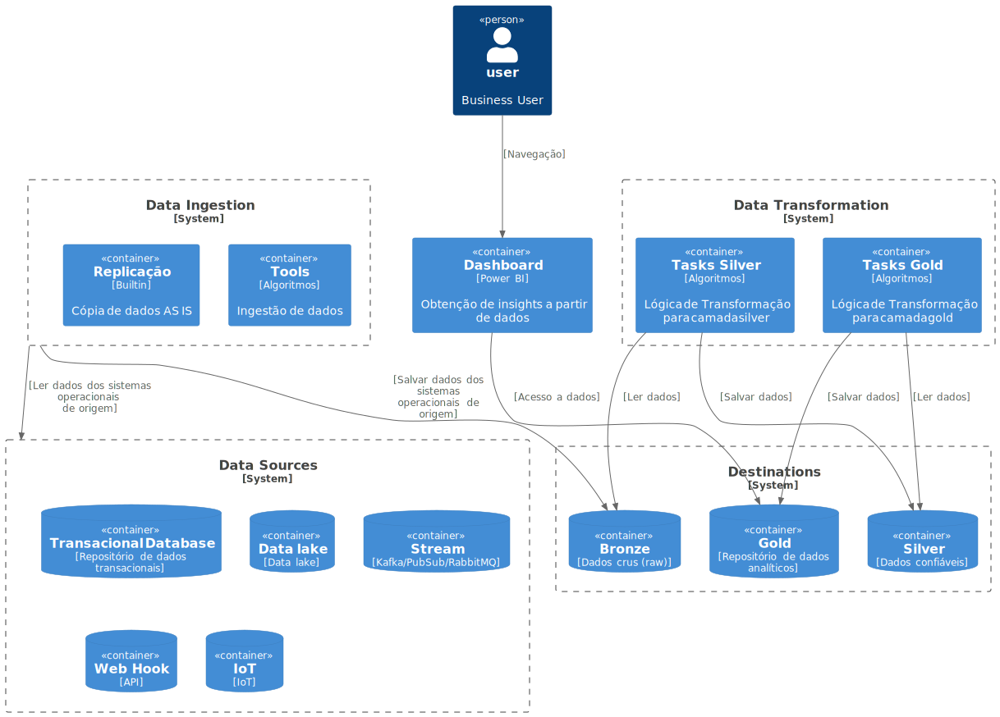
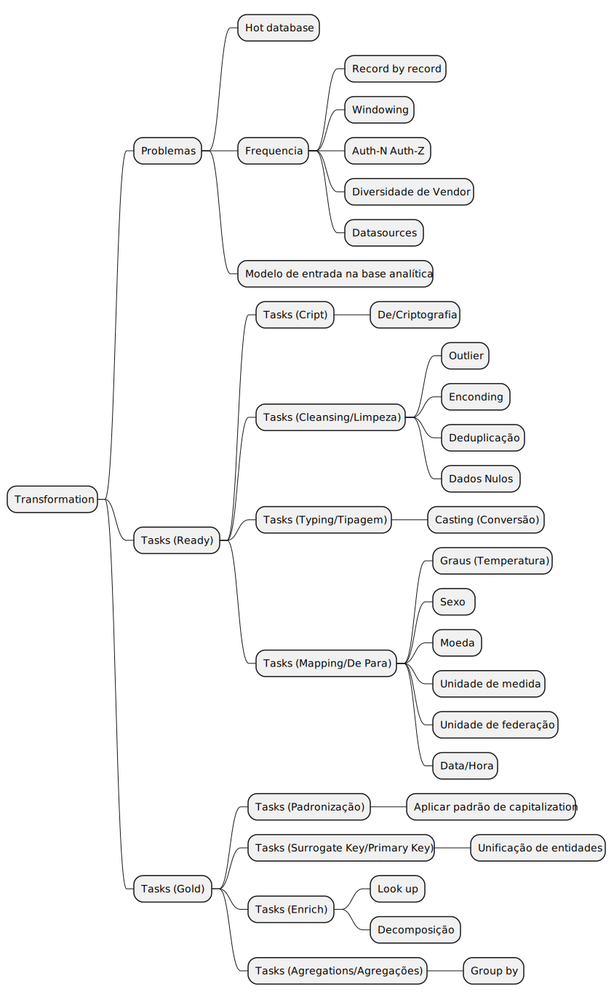

# Mackenzie

MBA em DevOps Engineering and Cloud Solutions

## Pessoas

###  [Apresentações](docs/apresentacao.md)

## DBRE (Database Reliability Engineer) e DataOps

### Conteúdo Programático

* DBRE e DataOps
* Gestão e Governança de Dados
* LGPD
* Arquitetura de Dados Relacionais
* Arquitetura NoSQL
* Soluções de Armazenamento de Dados na Nuvem
* Controle de versão em banco de dados com migrations

### %% AULA DE HOJE

- git clone https://github.com/acnaweb/python dbt
- https://medium.com/@samsorrahman/how-to-run-a-makefile-in-windows-b4d115d7c516
- https://pypi.org/
- https://docs.getdbt.com/docs/trusted-adapters
- https://docs.getdbt.com/docs/community-adapters
- https://jinja.palletsprojects.com/en/3.1.x/
- https://www.atlassian.com/data/sql/using-common-table-expressions#:~:text=What%20are%20Common%20Table%20Expressions,the%20duration%20of%20the%20query.

- 
### Metodologia

- Contexto
- Perguntas/Dúvidas/Desafios
- Soluções
- Implementação da solução

## Referencias

- [Data Ingestion/Airbyte: Site Oficial](https://airbyte.com/)
- [Data Ingestion/Airbyte: Install](https://github.com/acnaweb/airbyte)
- [Data Product: Data Contract](https://datacontract.com/)
- [Databases: Containers](https://github.com/acnaweb/database)
- [Test Container](https://testcontainers.com/)
- [Python: Install](https://www.python.org/downloads/)
- [Python: Repo template](https://github.com/acnaweb/python)
- [The 2024 MAD (ML, AI & Data) Landscape](https://mad.firstmark.com/)
- [Gitignore.io](https://www.toptal.com/developers/gitignore/)
- [Pre-commit](https://pre-commit.com/)

## Diagramas

### Data Pipeline



### Transformation Tasks



## Útil

```sh
export $(cat .env | xargs)
```

